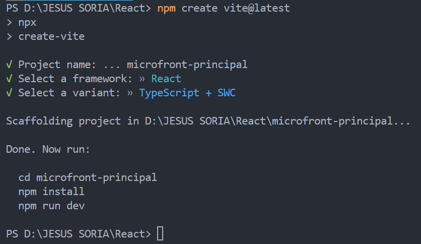

# React + TypeScript + Vite

This template provides a minimal setup to get React working in Vite with HMR and some ESLint rules.

Currently, two official plugins are available:

- [@vitejs/plugin-react](https://github.com/vitejs/vite-plugin-react/blob/main/packages/plugin-react/README.md) uses [Babel](https://babeljs.io/) for Fast Refresh
- [@vitejs/plugin-react-swc](https://github.com/vitejs/vite-plugin-react-swc) uses [SWC](https://swc.rs/) for Fast Refresh

## Expanding the ESLint configuration

If you are developing a production application, we recommend updating the configuration to enable type aware lint rules:

- Configure the top-level `parserOptions` property like this:

```js
export default tseslint.config({
  languageOptions: {
    // other options...
    parserOptions: {
      project: ['./tsconfig.node.json', './tsconfig.app.json'],
      tsconfigRootDir: import.meta.dirname,
    },
  },
})
```

- Replace `tseslint.configs.recommended` to `tseslint.configs.recommendedTypeChecked` or `tseslint.configs.strictTypeChecked`
- Optionally add `...tseslint.configs.stylisticTypeChecked`
- Install [eslint-plugin-react](https://github.com/jsx-eslint/eslint-plugin-react) and update the config:

```js
// eslint.config.js
import react from 'eslint-plugin-react'

export default tseslint.config({
  // Set the react version
  settings: { react: { version: '18.3' } },
  plugins: {
    // Add the react plugin
    react,
  },
  rules: {
    // other rules...
    // Enable its recommended rules
    ...react.configs.recommended.rules,
    ...react.configs['jsx-runtime'].rules,
  },
})
```

## IMAGEN DE COMO CREAR ESTE PROYECTO 




## COMANDOS QUE USE PARA CREAR ESTE PROYECTO

npm create vite@latest

npm i

npm install react-router-dom

npm run dev

## COMANDOS PARA SUBIR ESTE PROYECTO A GITHUB

git init

git add .

git commit -m "Archivos iniciales" -m "Co-authored-by: AlbertoSoria1998 < albertosoriasoria74@gmail.com >"

QUITAR LOS ESPACIOS DEL CORREO

git remote add origin https://github.com/jesus73514145/microfront-principal.git

git push -u origin master


## LINK DE ESTE PROYECTO EN AMPLIFY DE MICROFRONT - PRINCIPAL

https://master.d19gi5htckg2p9.amplifyapp.com/

## LINK DE ESTE PROYECTO EN AMPLIFY DE MICROFRONT 1

https://master.dbw8z78piw1nu.amplifyapp.com/

## LINK DE ESTE PROYECTO EN AMPLIFY DE MICROFRONT - 2

https://master.d1vid5xqqrcxyu.amplifyapp.com/


## COMANDO PARA CONFIGURAR EL CORREO Y USUARIO EN VISUAL STUDIO CODE

 git config --global user.email "MICORREODEGITHUB"

git config --global user.name "jesus73514145"
